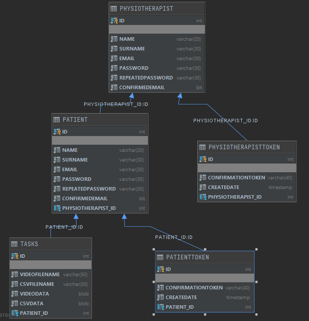
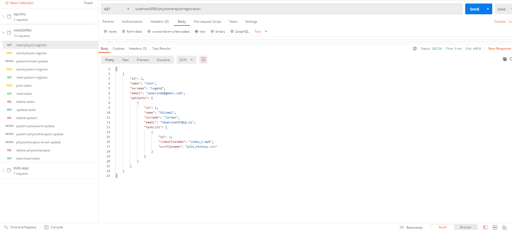

# HANDIPRO-SpringBoot

## Simple REST app designed for physiotherapists and patients

## Table of contents
* [General info](#general-info)
* [Technologies](#technologies)
* [Setup](#setup)

## General info
Main purpose of the app is to store data patients and physiotherapists in H2 database. If users want to be a part of the service they have to 
go through registration process. Registartion is based on email verification. When the app receives user's data like password, email, name and surname, it will send
email with a confirmation link. In order to confirm email address, the user ought to click the link, subsequently the app will generate confirmation token. In connection with the app development process, relational database is created.Many patients cab be attributed to one phyysiotherapist who can upload rehabilitation tasks for them. A great variety of tasks can be assigned to a patient. Each task entity consists a video clip and csv file.

## Technologies
* Java 13
* Spring boot
* Hibernate/JPA
* Flyway - SQL migration
* Maven
* JUnit
* Mockito

## Setup
The best way to setup this app is to use docker.

* Download docker from official docker website and install
* Open Power Shell and move to project's directory
* Create new docker image with command: docker bulid -f Dockerfile -t [your_image_name]:v1 .
* Run app with command: docker run -p 8000:8080 [three_leading_numbers_from_img_id]

## Screenshots

### Database schema

### Postman view

### Email verification

